# 🏎️  Real-Time ROS2 → Redis → Socket.IO → React Stack  

> one-command telemetry pipeline

---

## TL;DR

```bash
git clone https://github.com/ibrahimsel/ros-redis-rt-dashboard.git
cd ros-redis-rt-dashboard
docker compose build          # first time or whenever you change code
docker compose up -d          # open http://localhost:3000 after
```

That’s it. No global Python, no Node mess, no ROS installation on your host.
**Containerize or GTFO.**

---

## What’s inside

| Folder / File                  | What it does                                                                   |
| ------------------------------ | ------------------------------------------------------------------------------ |
| `provider/speed_publisher.py`  | ROS2 node puking random `Float64` speeds at **100 Hz** on `/speed`             |
| `redis/ros_to_redis.py`        | Subscribes `/speed` → publishes each value to Redis channel **`vehicle_data`** |
| `server/server.py`             | FastAPI + Socket.IO; relays Redis pub/sub to WebSocket “`update`” events       |
| `frontend/realtime-dashboard/` | React + Recharts dashboard drawing a live line chart                           |
| `docker-compose.yml`           | glue that spins Redis, ROS2 nodes, backend & frontend in one shot              |
| `Dockerfile*` × 4              | language-specific images, all self-contained                                   |

---

## Architecture

```mermaid
%% Real-time speed-telemetry architecture
flowchart TD
    subgraph realtime_network["Docker network: realtime"]
        direction LR
        SpeedPublisher["SpeedPublisher\nROS2 node"]
        Bridge["ROS_to_Redis\nbridge"]
        Redis["Redis 7\npub‒sub"]
        Backend["Backend API\nFastAPI + Socket.IO"]
        Frontend["Dashboard\nReact + Recharts"]
    end

    SpeedPublisher -- "/speed 100 Hz (DDS)" --> Bridge
    Bridge -- "PUBLISH 'vehicle_data'" --> Redis
    Redis -- "SUBSCRIBE 'vehicle_data'" --> Backend
    Backend -- "WebSocket 'update'" --> Frontend
```



---

## Ports

| Service     | Host port | Container port | Notes                         |
| ----------- | --------- | -------------- | ----------------------------- |
| Dashboard   | `3000`    | `80`           | Nginx serving built React app |
| Backend API | `8000`    | `8000`         | FastAPI + Socket.IO           |
| Redis       | `6379`    | `6379`         | Standard Redis port           |

---

## Environment variables (override with `docker-compose.override.yml` or `.env`)

| Var             | Default | Used by         | Description                        |
| --------------- | ------- | --------------- | ---------------------------------- |
| `REDIS_HOST`    | redis   | backend, bridge | Internal Docker DNS name for Redis |
| `REDIS_PORT`    | 6379    | backend, bridge | Redis TCP port                     |
| `ROS_DOMAIN_ID` | 0       | ROS2 nodes      | Keep both ROS containers in sync   |

---

## Dev workflow ☕

---

## Known quirks / TODO

* DDS multicast + Docker Bridge can get moody on exotic NICs.
  If `/speed` doesn’t pop, try `network_mode: host` on the ROS services.
* Only pushing a single metric; extend the ROS message & chart for more swag.
* No auth. Ship it behind a VPN or slap JWT on the backend before going public.

---

## License

Apache-2.0 because Stallman’s tears taste like espresso.

---

### Made with 🔥 & ☕ by an AI sidekick that keeps getting roasted (and Ibrahim Sel)
